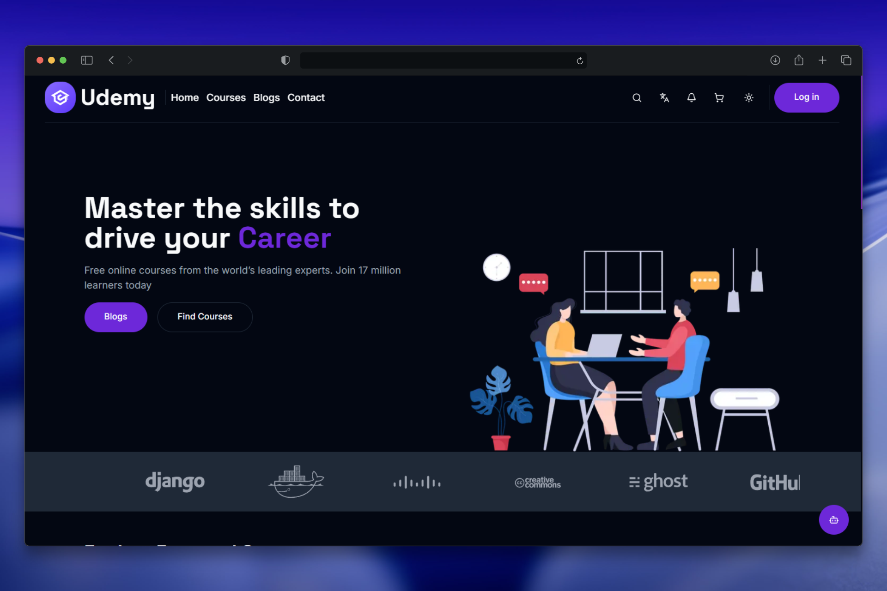
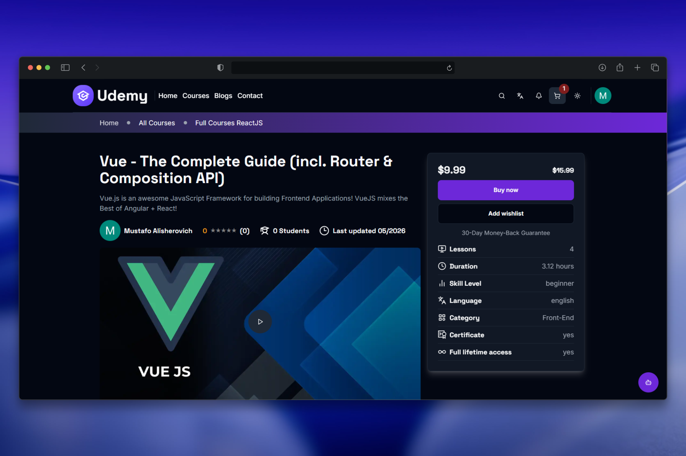
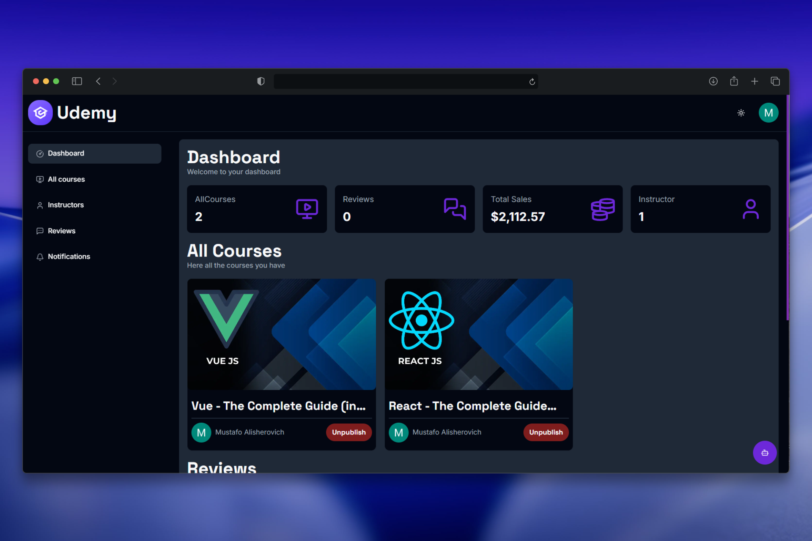

# 🎓 Udemy Clone

A modern, full-featured online learning platform inspired by Udemy. Built with **Next.js 14**, **TypeScript**, **MongoDB**, **ShadCN**, and **Clerk**. This project allows users to browse, purchase, and create courses in multiple languages, with integrated **Stripe payments** and role-based access.

## 🔗 Live Demo

[Click here to view the site](https://udemy-clone.mustafoalisherovich.ru)

---

## 📸 Screenshots







---

## 📌 Features

- 🔐 **Authentication & Authorization** via Clerk
- 🧑‍🏫 **Instructor Panel**:
  - Create, update, and manage your courses
  - Set courses as free or paid
  - Track total students, revenue, and reviews
- 🧑‍🎓 **Student Dashboard**
  - Enroll in free or paid courses
  - Leave reviews/comments
  - Track progress
- 🌍 **Localization**
  - Multilingual support: Uzbek 🇺🇿, Turkish 🇹🇷, Russian 🇷🇺, English 🇺🇸
- 💳 **Payments**
  - Integrated with **Stripe** for secure transactions
  - Instructors can see revenue generated
- 🖼️ **Image Optimization** with Next.js
- 👮‍♂️ **Role Management**:
  - `User`
  - `Instructor`
  - `Admin`

---

## 🛠️ Tech Stack

- **Frontend**: Next.js 14, TypeScript, ShadCN UI
- **Backend**: Next.js API routes, MongoDB
- **Auth**: Clerk
- **Payments**: Stripe
- **Localization**: Next.js i18n
- **Deployment**: Vercel

---

## 🧪 Getting Started

```bash
git clone https://github.com/MustafoAlisherovich/udemy-clone.git
cd udemy-clone
npm install
